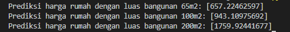

# Web Scraping dan Machine Learning

Repositori ini berisi pembelajaran awal saya membuat model machine learning. 

Untuk memperoleh dataset yang diperlukan saya melakukan [*web scraping*](scrap.py) menggunakan [BeautifulSoup4](https://www.crummy.com/software/BeautifulSoup/bs4/doc/) pada situs [https://www.99.co/id/perumahan](https://www.99.co/id/perumahan).

Berdasarkan data ini saya membuat sebuah pemodelan machine learning yang dapat memprediksi harga rumah berdasarkan luas bangunan yang diberikan.

Kontak: [linkedin.com](http://bit.ly/linkedinNRR)